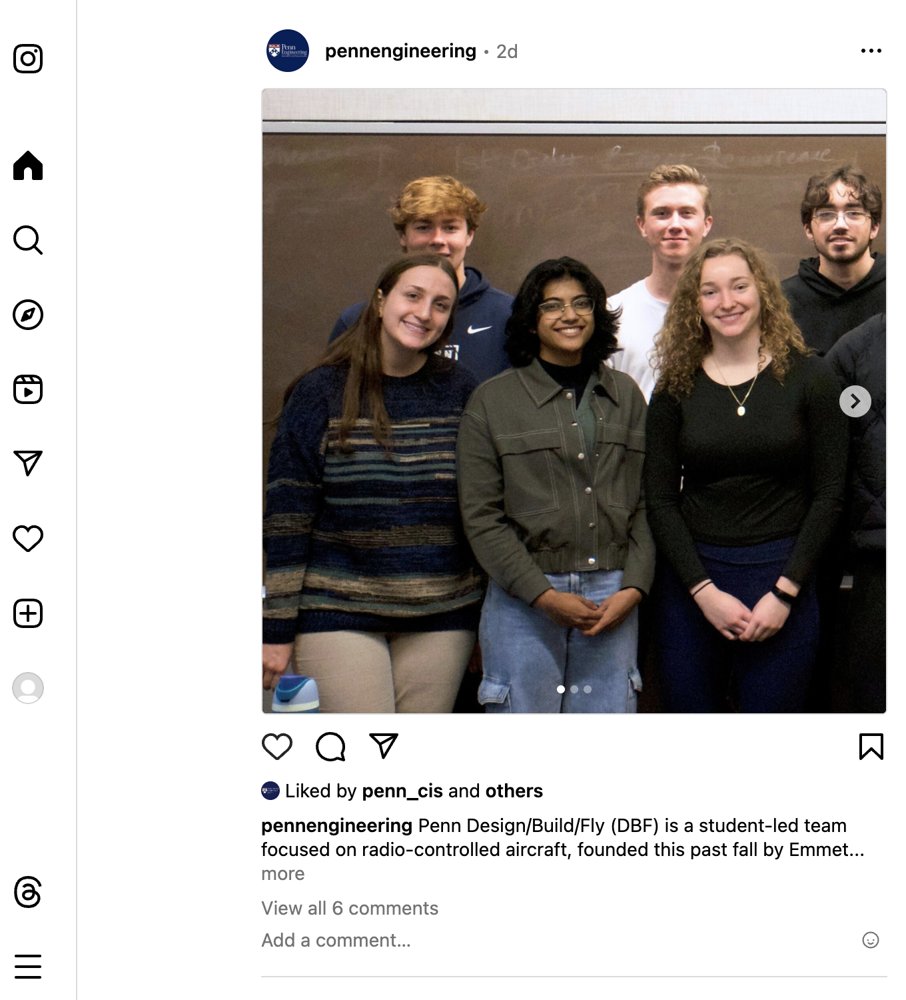

# InstaLite
# Collaborators: Shruti Agarwal, Daniel Rohacs, Patrick Wu
# Screenshots
Login/Signup:


Profile Photo Upload + Actor Matching (using vector similarity):

Home Page:

Notifications:

Settings:

User Profile:

Friends List:

Post Popup:

Chat Page:


## Overview

The course project will involve building "InstaLite," an Instagram-like social media site with full support for images (and optionally videos). This project is to be done in *teams* and will build upon components you built over the semester in your homeworks.

*Instructors' note*: During interviews, companies often ask you to tell them about a technical project you worked on. If you invest enough time, this project can play that role; you can add it to your “portfolio” of system that you can show a potential employer!  (We do ask that you keep your repo private, however.)

*General Advice*: Read through this entire document and compile a list of (1) data resources you'll need to design, (2) backend endpoints, (3) frontend pages / widgets, (4) interfaces to additional components such as ChatGPT and Apache Spark. Try to establish "core" functionality and build outwards.

## Project Technology Stack

Your project will have a number of elements, building upon what you did with the homework. We expect the following:

* **Backend** services in Node.js and/or Java, hosted on Amazon EC2 (you may use `nginx` to make these accessible through the same TCP port)
* **Database** (accounts, social network, etc.) hosted in RDS and/or DynamoDB (many aspects will work better in RDS)
* **Image search** based on embeddings similarity, in ChromaDB
* Large objects stored in S3, as necessary
* **Natural language search** using GPT or an alternative LLM
* Social **news streaming** via Apache Kafka
* Adsorption ranking of posts and individuals via Apache Spark
* Proper handling of security and sessions
* **Frontend** in React and Javascript
* Code in GitHub

## User Signup and User Accounts Backend

New users should be able to sign up for an account. They should enter, at the very least, a login name, a password, a first and last name, an email address, an affiliation (such as Penn), and a birthday.

* The password should be *salted* and encrypted following best practices.
* Users should be able to *upload a profile photo* -- on mobile, perhaps even taking a selfie for that photo -- as a starting point.
* Users should include a number of hashtags of interests.  The top-10 most popular hash tags (by occurrence) should be shown so they have a starting point.

The user should be able to link to a given *actor account* from IMDB by matching the *embedding* of their selfie with the *profile photos* of the 5 most similar actors.  They will be able to choose from those actors.

We will provide you with a set of actor embeddings and profile photos in the form of a ChromaDB database. You should use this to match the user's selfie to the actor's profile photos.

## User Login Page

The user should be able to log in with their user ID and password. (See Extra Credit for an option for resetting a forgotten password.)

## The User Page / Main Content Feed

When the user logs in, they should see an Instagram-style feed with status updates, new friendships, and profile updates (posts) made by friends. When Alice posts on Bob’s wall, her post should appear on both Alice’s and Bob’s walls and home pages.  Below is an example taken directly from Instagram.



**User Posts**: Each user should be able to make posts, containing an optional image and optional text. The post might include hashtags. Although each field is optional, a post should at least have *some* content to be valid.

**What Goes in the Feed**: Each user should see *posts* from their friends, themselves, as well as from *prominent figures*.  Posts can have text and images.  Some of the posts will also come from the social media stream (see below on **Feed**).

**Commenting**: Users should be able to add a comment under any post they can see (that is, both their own posts and their friends’ posts). These comments should appear under the post they respond to, in a threaded fashion.

The user page should include non-scrolling menu elements on the left (as in the screenshot) or top, for access to other capabilities such as the user profile and search (see below).  The main feed should paginate (default behavior) or support infinite scrolling by fetching more data on demand (see Extra Credit).

### Feed

As with Instagram, your user will see a **feed** of different posts. All posts are public, i.e. they will be considered for the feed based on the criteria below even when the post owner and the user aren't friends. These posts:

1. Come from the user's friends
2. Reference the user's selected hashtags of interests
3. Come from others with high SocialRank
4. Come from the course project **Twitter/X Feed** and score highly.  This will be made accessible to you through an Apache Kafka Topic.

**Feed updates**: Your server, while running, should refresh the data necessary for computing the feed once an hour.  This will involve fetching any "new news" from Kafka and from recent posts / activities; and ranking the content.  If you precompute the data, it should be easy for the client to produce the page upon login.

**User actions**:
Users should be able to “like” posts, and should be able to comment on them.  If a post or comment includes **hashtags** a link between the hashtag and post should be established.

**Ranking posts**: Every candidate post should be assigned (for each user) a weight. Weights will be computed with an implementation of the adsorption algorithm in Spark. This should run periodically, once per hour as descried above.

The Spark job should start by building a graph from the data underlying your social platform. The
graph should have a node for each user, each movie, each hashtag, and each post. It should also have
the following directed edges:

1. `(u, h)` and `(h, u)`, if user `u` has selected hashtag `h` as an interest
2. `(h, p)` and `(p, h)`, if post `p` is associated with hashtag `h`
3. `(u, p)` and `(p, u)`, if user `u` has “liked” post `p`
4. `(u1, u2)` and `(u2, u1)` if users `u1` and `u2` are friends

The Spark jobs should assign weights to the edges.

- For each hashtag node `h`, the weights on the `(h, a)` edges adjacent should be equal and add up
  to 1.
- Similarly, the outgoing edges from a post `p` should have equal weights that sum to 1.
- For each user `u`:
    - The weights on the `(u, h)` edges should be equal and sum up to 0.3
    - The weights on the `(u, p)` edges should be equal and sum up to 0.4
    - The weights on the `(u, u′)` edges should be equal and sum up to 0.3

Now run adsorption from the users to assign a user label + weight to each node (including the article nodes). Run to a maximum of 15 iterations or until convergence. Given the ranked graph as above, the social network recommender should take the set of potential articles (those from the same day, minus ones that have already been recommended), and normalize the adsorption-derived weights on these articles. Then it should randomly choose an article based on this weighted random distribution.

**Interfacing the Spark job with the Web Application**: We recommend your group thinks carefully about how the different components (data storage, Spark job to recompute weights, search / recommendation) interface.  You likely will want to invoke the Spark task via Livy or the equivalent, with an easily configurable address for the Spark Coordinator Node. Most likely you’ll want to use some form of persistent storage (e.g. RDS) to share the graph and other state.

### Federated Posts

Your site should have a *unique ID* distinguishing it from all other NETS 2120 sites. This will be your team number (e.g. `g01`). Through the Kafka `FederatedPosts` channel, your site should both *read* and *send* posts that can be used by other projects' InstaLite sites. Posts should have a JSON component called `post_json`:

```
{
    username: '...',
    source_site: '...',
    post_uuid_within_site: '...',
    post_text: '...',
    content_type: '...'
}
```

as well as a binary component, `attach`, including an optional image.  The `content_type` field in the JSON should be the HTTP content-type associated with the binary data.

## Secondary Screens

There should be at least the following options in a sidebar or other menu:

1. Profile page
2. Add/remove friends
3. Chat mode
4. Search (can be part of the home screen if you prefer)

### 1. Profile Page

Users should be able to change their associated actor after the account has been created. As before, the list of the top-5 most-similar actors (by embedding) should be displayed to allow for a change (they should only be able to pick from these 5). Changes should result in an automatic status post (“Alice is now linked to Rebecca Ferguson”). Users should also be able to change their email ID and their password, without triggering a post.

They should be able to update their hashtags representing interests. Additional hashtags should be suggested to them.

### 2. Add/Remove Friends

**Add/Remove Friends**: Users should be able to add and remove friends, and they should see a list of their current friends. The list of friends should indicate which friends, if any, are **currently logged into the current system**.

**(EC only) Friend Requests**: If a user sends a friend request to another user, the other user should receive a notification of some kind that enables him or her to accept or reject the request. If the request is accepted, the two users should become friends. If the request is rejected, the two users should not become friends.

### 3. Chat Mode

There should be a way for users to chat with each other. You can implement this functionality with basic AJAX requests using polling; for extra credit, consider using WebSockets with socket.io. Read more about the different implementation choices [here](https://medium.com/geekculture/ajax-polling-vs-long-polling-vs-websockets-vs-server-sent-events-e0d65033c9ba).

**Chat invites**: When a user’s friend is currently online, the user should be able to invite the friend to a chat session, and the friend should receive a notification of some kind that enables him or her to join the chat. If the friend accepts the invitation, a chat session should be created between the two users. If the friend rejects the invitation, no chat session should be created.

**Persistence**: The contents of a chat session should be persistent - that is, if two users have chatted before and a new chat session between the same pair of users is established later, the new session should already contain the messages from the previous chat.

**Leaving chat**: Any member of a chat session should be able to leave the chat at any time. The chat should continue to work as long as it contains at least one member. When the last member leaves a chat session, the chat session should be deleted.

**Group chat**: There should also be a way to establish a group chat by inviting additional members to an ongoing chat. When a new member joins a chat, they are able to see previous chat history starting from the creation of the group chat. Each group chat created is a unique and independent chat session, even when the same users are involved (e.g., X, Y, and Z created Chat 1; X, Y, and W created Chat 2; if Z and W leave their chats, X and Y should now have two independent group chats). However, if a new invite results in a chat session involving the same user group as an existing chat session, the invite should not be allowed. You also may not invite an existing member to a chat session.

**Ordering**: The messages in a chat (or group chat) session should be ordered consistently - that is, all members of the chat should see the messages in the same order. One way to ensure this is to associate each chat message with a timestamp, and to sort the messages in the chat by their timestamps.

### 4. Natural Language Search

Uses should be able to search (1) for people, and (2) for posts. These should use *retrieval-augmented generation* over the indexed content of actors, movie reviews, and posts; and should use a Large Language Model to find the best matches.

**EC**: ensure the search results return links so users can add friend / follow / interest based on the returned results.

### Security and Scalability

You should ensure that your design is secure: for instance, users should not be able to impersonate other users (without knowing their password), and they should not be able to modify or delete content that was created by other users. 

Your design should also be scalable: if a million users signed up for your system tomorrow, your system should still work and provide good performance (although of course you will have to add some extra resources, e.g., additional EC2 instances). Keep in mind that many of the cloud services we have discussed, such as DynamoDB and Spark/MapReduce, are naturally scalable.

### Recommend Who and What to Follow

Based on the link structure of the graph as well as the activity and hashtag structure of the streaming posts, your system should on a daily basis recompute a list of recommendations for "who to follow".

